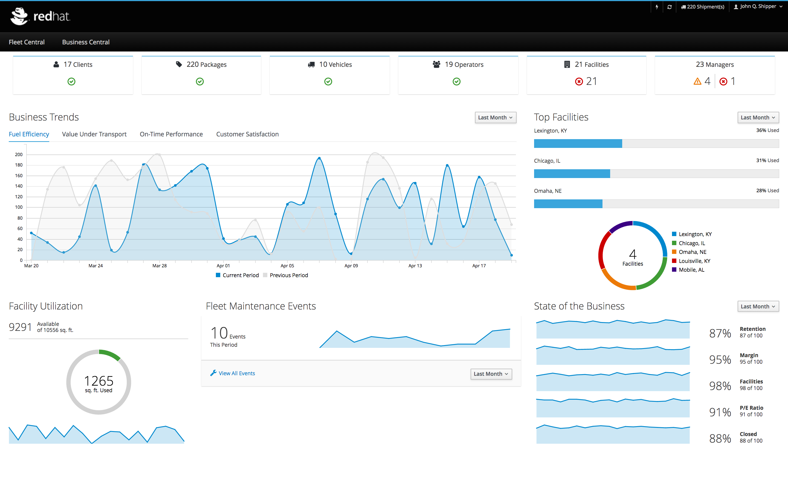

Red Hat Fleet Telematics & Asset Tracking IoT Demo
==================================================
This is an example IoT demo showing a realtime updating dashboard of data streaming from an
IoT gateway device (based on Eclipse Kura) through an Eclipse Kapua-based instance.

It demonstrates realtime fleet telematics, package tracking, alerting, and a telemetry dashboard showing critical measurements of packages in transit,
including temperature, humidity, displacement, light levels, etc.




Technologies used:

- [Eclipse Kapua](http://www.eclipse.org/kapua/)
- [AngularJS](http://angularjs.org)
- [Patternfly](http://patternfly.org)
- [JBoss Middleware](https://www.redhat.com/en/technologies/jboss-middleware) (EAP, JDG, and more to come)

Running on OpenShift
--------------------

The demo deploys as an Angular.js app running on a Node.js runtime, along with JBoss Data Grid and a Data Grid
proxy component that properly handles browser-based REST requests and relays to JBoss Data Grid via the Hotrod
protocol.

Eclipse Kapua is also deployed and acts as the IoT cloud management layer.

Follow these steps to build and run the demo:

1. Install and have access to an [OpenShift Container Platform](https://www.openshift.com/container-platform/) 3.4 or later or [OpenShift Origin](https://www.openshift.org/) 1.4 or later. You must be able to use the `oc` command line tool.

2. Clone this repo
```
git clone https://github.com/redhat-iot/summit2017
cd summit2017
```

3. Issue the following commands to create a new OpenShift project and deploy the demo components:
```
oc new-project eclipseiot-assettracking-testbed --display-name="Eclipse IoT Asset Tracking Testbed"
oc policy add-role-to-user view system:serviceaccount:$(oc project -q):default -n $(oc project -q)
./openshift-deploy.sh
```

You can monitor the build with `oc status` or watch the deployments using the OpenShift web console.

If you see some components with "No Deployments" or are not building, you may need to add imagestream
definitions for ``wildfly`` and ``jboss-datagrid``. To do so, run these commands:

```
oc login -u system:admin (Or login with any userid that has cluster-admin privileges, TODO: Explain all options here)
oc create -n openshift -f https://raw.githubusercontent.com/jboss-openshift/application-templates/master/jboss-image-streams.json
oc create -n openshift -f https://raw.githubusercontent.com/openshift/origin/master/examples/image-streams/image-streams-centos7.json
```

Once everything is up and running, you can access the demo using the URL of the `dashboard` route,
for example `http://dashboard-eclipseiot-assettracking-testbed.domain`

Confirm that all the components are running successfully:

```
oc get pods --show-all=false
```
You should see the following pods and their status:

|NAME                 |   READY     | STATUS  |
|---------------------|:-----------:|:-------:|
|dashboard-1-xxx      |    1/1      | Running |
|datastore-1-xxx      |    1/1      | Running |
|datastore-proxy-1-xxx|    1/1      | Running |
|elasticsearch-1-xxx  |    1/1      | Running |
|kapua-api-1-wc1l7    |    1/1      | Running |
|kapua-broker-1-xxx   |    1/1      | Running |
|kapua-console-1-xxx  |    1/1      | Running |
|simulator-1-xxx      |    1/1      | Running |
|sql-1-xxx            |    1/1      | Running |

Eclipse Kapua API Documentation
-------------------------------
Eclipse Kapua exposes a REST API which can be used to access Kapua data and invoke Kapua operations. The REST API application is running as a dedicated Java process.

For example, to use the `curl` command login to Eclipse Kapua and retrieve an authentication token:

```
curl -X POST --header 'Content-Type: application/json' --header 'Accept: application/json' -d '{"password": ["your_password"], "username": "your_username"}' 'http://api-redhat-iot.domain/v1/authentication/user'
```

Once logged in, the retrieved token can be passed for future API calls, e.g.

```
curl -X GET --header 'Content-Type: application/json' --header 'Accept: application/json' --header 'Authorization: Bearer <AUTH_TOKEN_HERE>' http://api-redhat-iot.domain/v1/my_scope/devices
```

The complete API documentation can accessed using the URL of the `api` route, for example `http://api-redhat-iot.domain/doc`. More information on the REST API can be found in the [Eclipse Kapua user guide](http://download.eclipse.org/kapua/docs/develop/user-manual/en/rest.html).


Add template to "Add to project"
--------------------------------
The following command will add the template and the options to the "Add to project" screen in the 
"Other" section. The template will deploy with defaults the same as it does using the scripts above.
```
oc create -f iot-demo.yml
```

Options
-------
The template contains various optional parameters that can be specified when deploying the components:

```
oc process -f openshift-template.yaml OPTION1=value OPTION2=value | oc create -f -
```

* `MAVEN_MIRROR_URL` - To speed up Maven-based builds
* `GOOGLE_MAPS_API_KEY` - for your personal Google Maps API key
* `GIT_URI` and `GIT_REF` - overrides where source code is pulled (e.g. using your own personal fork)
* `IMAGE_VERSION` - Docker image tag to use when pulling Kapua (default `latest`)
* `DOCKER_ACCOUNT` - Name of docker account to use when pulling Kapua (default: `redhatiot`)

There are other options in the template that can be overridden if you know what you are doing!

Uninstalling and cleaning up project
------------------------------------
```
oc delete all --all -n eclipseiot-assettracking-testbed && oc delete configmap hawkular-openshift-agent-kapua data-simulator-config -n eclipseiot-assettracking-testbed
```
This will delete everything but the project "Red Hat IoT". This is suitable for testing new scripts, template,
etc.
